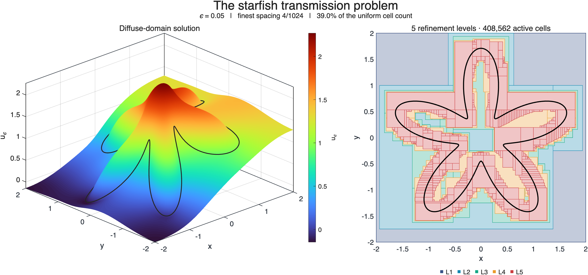
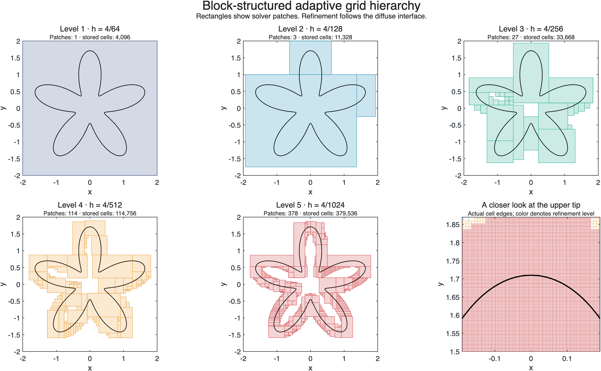
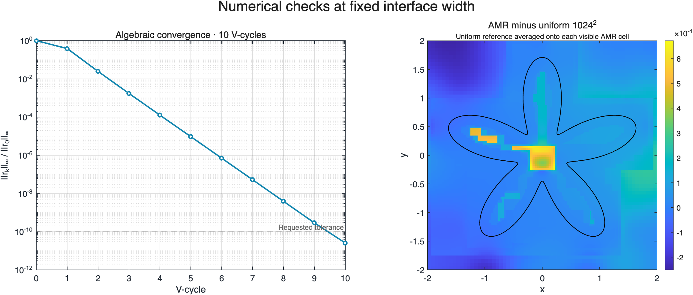

# BSAM in MATLAB

**Block-structured adaptive multigrid for two-dimensional PDEs.**

MATLAB solvers for elliptic, parabolic, and diffuse-domain problems, with
refinement concentrated where the solution or geometry needs it. The
elliptic solver comes in two implementations: a **QC-ring hierarchy** and a
**strict single-parent tree**. Both use cell-centered finite differences,
adaptive FAS multigrid, and conservative coarse–fine flux corrections.

[](figures/starfish-overview.pdf)

The starfish example uses the geometry and transmission problem from
[DiffuseDomainHelmholtz](https://github.com/Calvin1127XD/DiffuseDomainHelmholtz).
Click any figure to open its PDF. The plots are generated from the solved
field and the actual patch hierarchy.

## Included Solvers

| Package | Problem | Entry point |
|---|---|---|
| [EllipticBSAM](EllipticBSAM/) | Variable-coefficient elliptic equations; QC-ring hierarchy | `ebSolve` |
| [EllipticBSAMTree](EllipticBSAMTree/) | The same elliptic discretization; one parent per patch | `ebtSolve` |
| [ParabolicBSAM](ParabolicBSAM/) | Diffusion–reaction equations; BE, BDF2, Crank–Nicolson | `ebpSolve` |
| [DiffuseDomainBSAM](DiffuseDomainBSAM/) | Irregular-domain Neumann/Dirichlet problems and two-sided transmission | `ddSolve`, `ddTransmissionProblem` |

## Quick Start

Open this folder in MATLAB, then run:

```matlab
bsamSetup
demoStarfish('quick')       % 64 -> 512 cells per direction near the interface
```

To reproduce the README figures and the uniform-grid comparisons:

```matlab
demoStarfish('full')        % 64 -> 1024, with uniform 512 and 1024 solves
runVerification            % four solver suites + starfish regression checks
```

Verified with **MATLAB R2026a** on Apple silicon. The solvers and starfish
example use base MATLAB; no MEX compilation or extra toolbox is required.
Other MATLAB releases have not been tested for this package.

### Elliptic: QC-ring and tree

```matlab
u = @(x,y) sin(2*pi*x).*sin(2*pi*y);
f = @(x,y) (1 + 8*pi^2)*u(x,y);      % -Laplace(u) + u = f

p = ebProblem([0 1 0 1], 1, 1, f, {'dirichlet',0}, u);
ring = ebSolve(p, 'BaseCells',32, 'MaxLevels',3, 'TagThreshold',1e-2);

p = ebtProblem([0 1 0 1], 1, 1, f, {'dirichlet',0}, u);
tree = ebtSolve(p, 'BaseCells',32, 'MaxLevels',3, 'TagThreshold',1e-2);
ebtTreeCheck(tree.H)
```

### Parabolic: heat diffusion

```matlab
u0 = @(x,y) 1 + 0.2*cos(2*pi*x).*cos(2*pi*y);
p = ebpProblem([0 1 0 1], 1, 0, 0, {'neumann',0}, u0);
heat = ebpSolve(p, 'Scheme','bdf2', 'Dt',0.002, 'TFinal',0.1, ...
    'BaseCells',32, 'MaxLevels',3, 'RegridEvery',5);
plot(heat.t, heat.mass); xlabel('t'); ylabel('Composite mass');
```

Each package also includes its original examples and tests. Keep the four
package folders side by side: parabolic and DDM solvers share the QC-ring
elliptic kernel. `bsamSetup` adds source directories without mixing test
helpers that have the same names.

## Mathematical Problems

### Elliptic and parabolic equations

The elliptic packages solve

$$
-\nabla\cdot(D(x,y)\nabla u) + C(x,y)u = f(x,y),
$$

with $D>0$, $C\geq0$, and Dirichlet or Neumann data on each side of a
rectangular box. The parabolic package solves

$$
u_t-\nabla\cdot(D(x,y,t)\nabla u)+C(x,y,t)u=f(x,y,t).
$$

Implicit time stepping reuses the elliptic solver. Regridding transfers
the current solution and BDF2 history conservatively.

### Starfish transmission problem

The interface is

$$
r(\theta)=0.9\bigl(1.2+0.7\sin(5\theta)\bigr),
\qquad (x,y)=r(\theta)(\cos\theta,\sin\theta).
$$

On $[-2,2]^2$, with homogeneous Neumann outer boundaries, the diffuse model is

$$
-\nabla\cdot(D_\varepsilon\nabla u_\varepsilon)
+c_\varepsilon u_\varepsilon
+(\kappa u_\varepsilon+g)|\nabla\phi_\varepsilon|=f_\varepsilon,
$$

where $d$ is positive inside the starfish and

$$
\begin{aligned}
\phi_\varepsilon &= \tfrac12\bigl(1+\tanh(d/\varepsilon)\bigr),\\
D_\varepsilon &= \alpha+(1-\alpha)\phi_\varepsilon,\\
c_\varepsilon &= \beta(1-\phi_\varepsilon)+\gamma\phi_\varepsilon,\\
f_\varepsilon &= h(1-\phi_\varepsilon)+q\phi_\varepsilon.
\end{aligned}
$$

The reference parameters and active forcing are retained:

$$
\varepsilon=0.05,\quad \alpha=3,\quad \beta=2,\quad
\gamma=1,\quad \kappa=0.01,
$$

$$
q(x,y)=15-x^2,\qquad h(x,y)=2.5\sin x+e^{\cos y},\qquad g=4.
$$

The implementation uses $C=c_\varepsilon+\kappa|\nabla\phi_\varepsilon|$
and $F=f_\varepsilon-g|\nabla\phi_\varepsilon|$. Signed distance is evaluated
directly against the reference's 3000-point boundary polygon, using a
bounding-box tree to accelerate nearest-segment queries.

The original one-sided `ddSolve` examples use a different phase profile,
$(1-\tanh(3\psi/\varepsilon))/2$. The transmission adapter keeps the
Helmholtz convention explicit. See [the starfish notes](docs/starfish.md).

## Grid Hierarchy

[](figures/starfish-hierarchy.pdf)

The full example starts at $64^2$ and refines through five levels to the
spacing of a $1024^2$ grid near the interface. A separate coverage check
tests every finest-grid cell center in $|d|<\varepsilon$.

| Full starfish run | Measured result |
|---|---:|
| Visible composite cells | 408,562 |
| Uniform grid at the same finest spacing | 1,048,576.0 |
| Reduction in active cell count | 61.0% |
| Stored AMR cells, including covered coarse cells | 543,384 |
| V-cycles | 10 |
| Relative composite residual | 2.55e-11 |
| Relative L2 difference from uniform 1024² | 1.06e-04 |
| Maximum difference from restricted uniform 1024² | 6.72e-04 |
| Uncovered cell centers in the tested interface band | 0 |

Cell counts measure refinement savings; they are not a wall-time or memory
speedup claim. The comparison is at fixed epsilon against a numerical
reference, with that reference averaged onto the visible AMR cells.


## Numerical Method

- **Discretization:** cell-centered finite differences in flux form, with
  diffusion sampled at face centers.
- **Multigrid:** adaptive full approximation scheme (FAS), red–black
  Gauss–Seidel smoothing, conservative restriction, and bilinear correction
  prolongation.
- **Coarse–fine interfaces:** quadratic or linear ghost interpolation with
  flux-balance corrections.
- **Adaptivity:** solution indicators or geometry tags, buffered refinement,
  Berger–Rigoutsos clustering, and a refinement ratio of two.
- **Time integration:** backward Euler, BDF2 with a backward-Euler first step,
  and Crank–Nicolson with time-dependent coefficients and boundary data.

| Hierarchy detail | QC-ring | Strict tree |
|---|---|---|
| Patch parentage | A child may overlap multiple parent patches | Exactly one parent |
| Clustering | Across the level | Within each parent |
| Coarse data for interpolation | Gathered from owner patches | A contiguous parent window |
| Shared numerics | QIF/LIF interpolation, adaptive FAS, flux correction | Same |

## Verification

[](figures/starfish-validation.pdf)

The copied solver suites check manufactured-solution convergence,
coarse–fine conservation, tree invariants, time-stepping order, regridding,
and diffuse-domain examples. Additional checks cover starfish distance,
transmission signs, actual interface coverage, and adaptive/uniform
agreement at fixed $\varepsilon$.

See [verification results and commands](verification/README.md) and
[machine-readable starfish results](verification/starfish-full.json).
Package-level historical reports are retained for context; the verification
page identifies the checks rerun for this repository.

## Repository Layout

```text
BSAM-in-MATLAB/
├── EllipticBSAM/           # QC-ring elliptic solver, examples, tests, docs
├── EllipticBSAMTree/       # strict-tree elliptic solver, examples, tests, docs
├── ParabolicBSAM/          # implicit time stepping and conservative regridding
├── DiffuseDomainBSAM/      # irregular-domain and transmission formulations
├── examples/              # starfish solve and figure generation
├── tests/                 # independent starfish regressions
├── figures/               # README figures as PNG and PDF
├── verification/          # measured results and reproduction commands
├── provenance/            # source snapshot hashes and reference commit
├── bsamSetup.m
├── runVerification.m
└── LICENSE
```

## Documentation and References

- [QC-ring solver documentation](EllipticBSAM/BSAM_Code_Documentation.pdf)
- [Strict-tree solver documentation](EllipticBSAMTree/EllipticBSAMTree_Documentation.pdf)
- [Diffuse-domain analysis and its assumptions](DiffuseDomainBSAM/docs/ddm_analysis.pdf)
- Feng, Guo, Lowengrub & Wise, *A mass-conservative adaptive FAS multigrid
  solver for cell-centered finite difference methods on block-structured,
  locally-cartesian grids*, J. Comput. Phys. **352** (2018), 463–497.
- [A Diffuse Domain Approximation with Transmission-Type Boundary Conditions I:
  Asymptotic Analysis and Numerics](https://arxiv.org/abs/2412.07007)
- [A Diffuse Domain Approximation with Transmission-Type Boundary Conditions II:
  Gamma–Convergence](https://arxiv.org/abs/2504.17148)
- [DiffuseDomainHelmholtz](https://github.com/Calvin1127XD/DiffuseDomainHelmholtz)
- [Multigrid Methods](https://doi.org/10.1515/9783111354880) and
  [the accompanying book code](https://github.com/stevenmwise/MultigridCourse)

## Packaging

This collection copies the four 2D MATLAB solvers from the research
checkout and adds a reproducible starfish example. Solver kernels retain
their recorded source hashes. Generated caches, MEX binaries, unrelated
research projects, and local machine paths are excluded. Test output and
MAT-files are regenerated on demand. Source provenance and documentation
changes are recorded in [provenance](provenance/README.md).

Licensed under [Apache 2.0](LICENSE).
